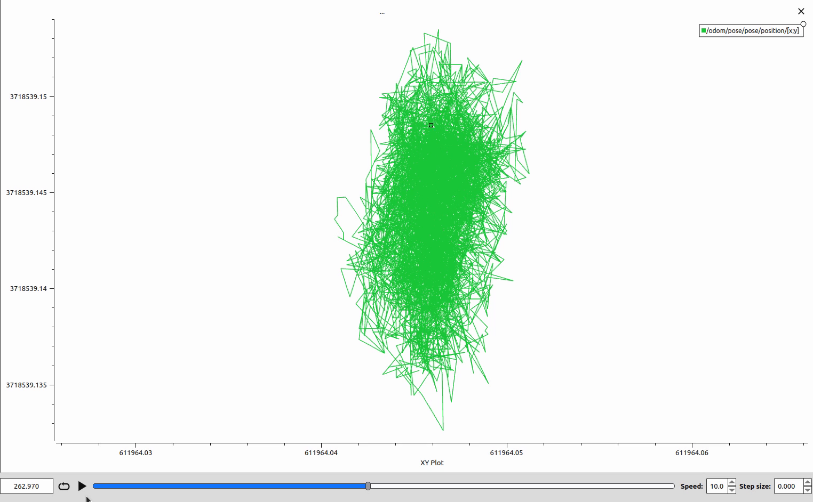

# RTK-GNSSで計測する

## 使用したgnss

u-bloxのzedf9p

## 用意された基準局を用いてRTK-GNSSで計測する

使用した基準局は[善意の基準局掲示板](https://rtk.silentsystem.jp/)から秋田県雄勝郡のものを使用した． \
（うまくいかない場合に使用する基準局を変更しただけでうまくいったりしたので，うまくいかない場合はそこも疑ってみるとよい）\
以下のコマンドを実行する．通信できている場合は通信量が表示される

```sh
./str2str -in ntrip://rtk2go.com:2101/[基準局のMountPoint] -out serial://ttyACM0:230400
```

## ローカル環境でRTK測位する

基準局．（1Hzで設定しておく）\
起動すると`waiting`という表示が続く．\
移動局とtcp通信を確立すると表示が変わる．通信量が表示される．

```sh
./str2str -in serial://ttyACM0:230400#rtcm3 -out tcpsvr://xxx.xxx.xxx.xxx:<port>
```

移動局．\
移動局とtcp通信を確立すると表示が変わる．IPアドレスと通信量が表示される．

```sh
./str2str -in tcpcli://xxx.xxx.xxx.xxx:<port>#rtcm3 -out serial://ttyACM1:230400
```

## ROSでTopicとして座標情報を出力する．

```sh
roslaunch nmea_navsat_driver nmea_serial_driver.launch
```

野外で実験を行った結果，プラマイ1~2cm程度の精度で計測することができた．



## 注意点

基準局が無線LANの場合でWiFiアクセスポイントから遠いとRTK-GNSSがFixモードにならないことがある．
その間，rtklibのstr2strに表示されるメッセージは正常に通信ができることになっていたが，u-centerでrtk測位を実行してログを確認したところエラーメッセージが発生していた．
一見正常に見えてうまく動作しない場合は，u-centerでデバッグを行うのがよい．

## 参考

- [善意の基準局掲示板](https://rtk.silentsystem.jp/)
- [NTRIP CasterServer の構築](https://qiita.com/yasushi00/items/50d4ad15083e468553d1)
- [自分用のNTRIP caster をたてる](https://qiita.com/XPT60/items/29d2d3575d3e42462387)
- [NTRIP CasterServer の構築](https://qiita.com/yasushi00/items/50d4ad15083e468553d1)
- [Ublox ZED-F9P RTK-GNSS 移動局を ROS で使用](https://qiita.com/k-koh/items/8fd8ef6310e4f40fa536)
- [Ublox ZED-F9P RTK-GNSS 基準局の構築](https://qiita.com/k-koh/items/c53998c76d9b4cb41afe)
- [ROSでRTK-GNSS](https://qiita.com/shimoe/items/989c0d10acd46fb9adde)
- [RTK基地のハンドリングに使っているスクリプト](https://qiita.com/yasunori_oi/items/fa22fee969e25768375d)
- [GPSの研究　その17](https://qiita.com/ohisama@github/items/bcf993f4409b2ea4b181)
- [RTKに必要な基準局を設置してみよう！](https://qiita.com/Ogawa_AITOYA/items/cd3fc1b8bb86700dafe5)
- [NtripCaster～ネットワーク式RTK-GNSSの補正情報配信サーバー～について](https://qiita.com/m_take/items/f416b62fb6edfb7a8c4d)
- [Containerised NTRIP Caster](https://github.com/charlesquick/ntripcaster-containerised)
- [RTK F9P Positioning Solutions](https://drotek.gitbook.io/rtk-f9p-positioning-solutions/)
- [センチメートルGPS測位 F9P RTKキット・マニュアル](https://shop.cqpub.co.jp/detail/2509/)
